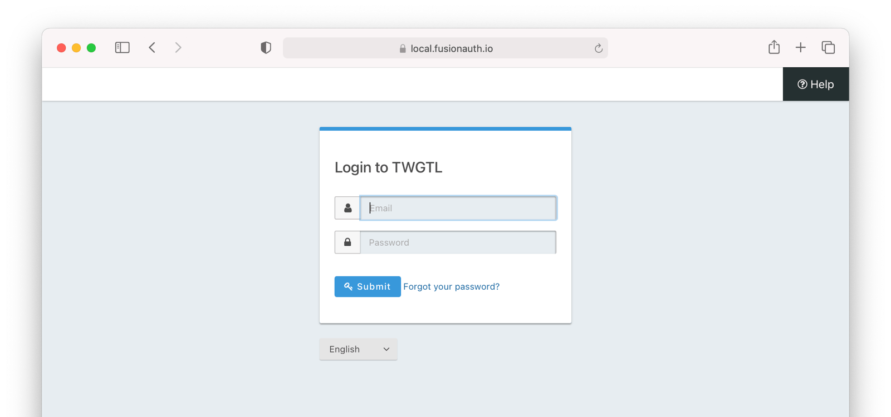
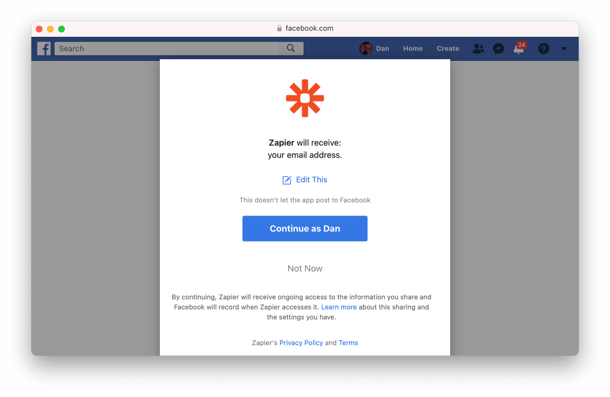
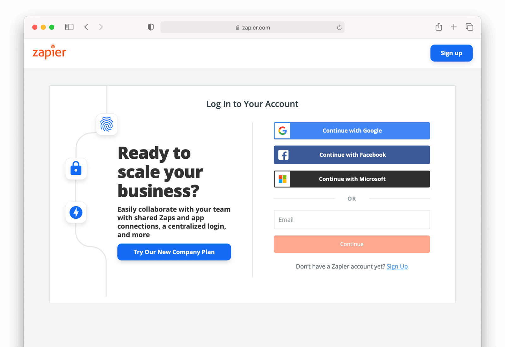
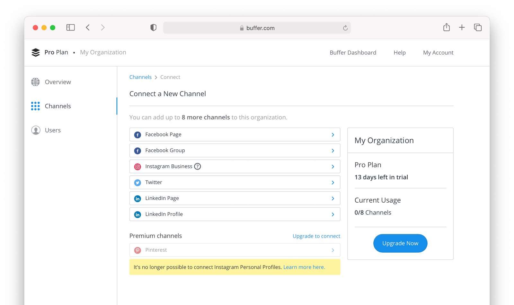
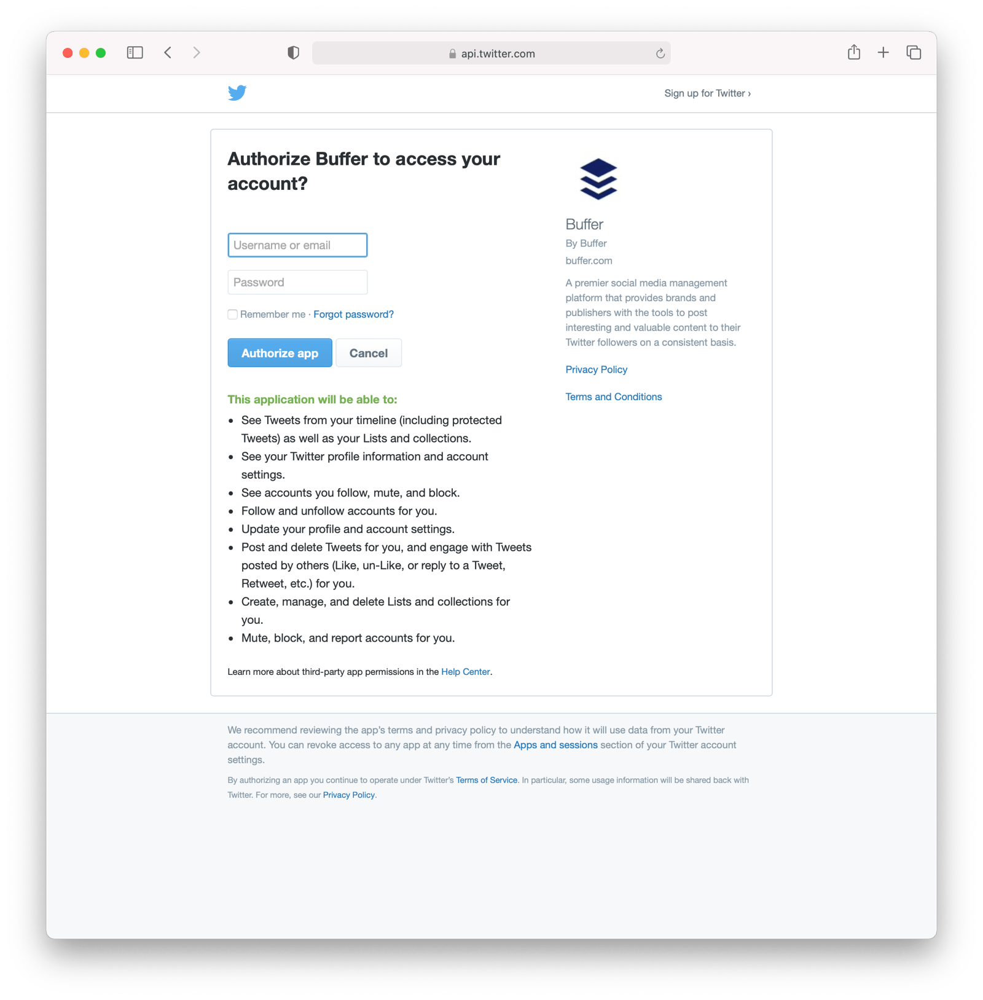
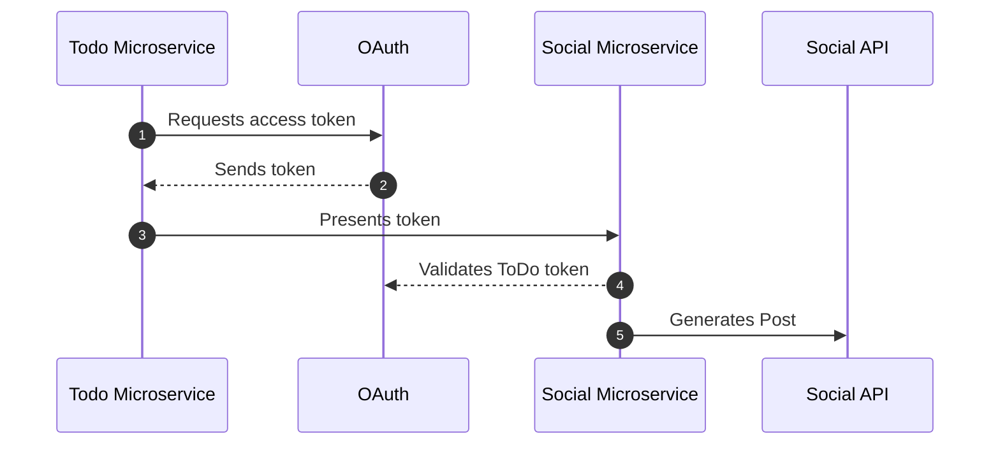

# [OAuth](https://fusionauth.io/articles/oauth/modern-guide-to-oauth)

OAuth 2.0 is a set of specifications that allow developers to easily delegate the authentication and authorization of their users to someone else. While the specifications don't specifically cover authentication, in practice this is a core piece of OAuth.

Before authentication and authorization with OAuth was available, websties would ask users to enter a username and password into a form, for example the credentials for a Gmail account, to gain access to Gmail data. Users realized they didn't want to grant full access to any old service. They preferred limited access instead. A user might want a third party service to access their email account, but only have rights to read contacts, not send email or add contacts.

When using OAuth, a token, which has a limited lifetime, provides the constrained access. Connecting multiple applications is easier for users. It is also more secure since user credentials are not shared. Auth is also easier for developers to manage because they only need to integrate OAuth 2.0 in their application instead of having their own database to store users' sensitive information.

## OAuth Modes

None of the specifications cover how OAuth is actually integrated into applications. They also don't cover the different workflows or processes that leverage OAuth. They leave almost everything up to the implementer (the person who writes the OAuth Server) and the integrator (the person who integrates their application with that OAuth server).

There are eight OAuth modes in common use today. These real world OAuth modes are:

1. Local login and registration
2. Third-party login and registration (*federated identity*)
3. First-party login and registration (*reverse federated identity*)
4. Enterprise login and registration (*federated identity with a twist*)
5. Third-party service authorization
6. First-party service authorization
7. Machine-to-machine authentication and authorization
8. Device login and registration

### Which OAuth Mode Is Right For You?

Theres a lot of differentw ays you can use OAuth. That's the power and danger of it; it's so flexible that people new to it can be overwhelmed. There's a set of questions to ask yourself:

* Are you looking to outsource your autentication and authorization to a safe, secure and standards-friendly auth system? You'll want [Local login and registration](#local-login-and-registration).

* Trying to avoid storing any credentials because you don't want responsiblity for passwords? [Third-party login and registration](#third-party-login-and-registration).

* Are you selling to Enterprise customers? Folks who hear terms like SAML and SOC2 and are comforted, rather than disturbed? [Enterprise login and registration](#enterprise-login-and-registration).

* Are you building service to service communicatino with no user involved? [Machine-to-machine authorization](#machine-to-machine-authorization).

* Are you trying to let a user log in from a separate device? That is, from a TV or similar device wtihout a friendly typing interface? [Device login and registration](#device-login-and-registration).

* Are you building a platform and want to allow other developers to ask for permissions to make calls to APIs or services on your platform? [First-party login and registration](#first-party-login-and-registration) and [First-party service authorization](#first-party-service-authorization).

* Do you have a user store already integrated and only need to access a third party service on your users' behalf? [Third-party service authorization](#third-party-service-authorization).

### Local Login and Registration

The **Local login and registration** mode is when you are using an OAuth workflow to register or log users into your application. In this mode, you own both the OAuth server and the application. You might not have written the OAuth server, but you control it. In fact, this mode usually feels like the user is signing up or logging directly into your application via **native forms** and there is no delegation at all.

The only difference between native forms and the **Local login and registration** OAuth mode is that with the latter you delegate the login and registration process to an OAuth server rather than writing everything by hand. Additionally, since you control the OAuth server and your application, it would be odd to ask the user to "authorize" your application. Therefore, this mode does not include the permission grant screens.

The workflow for this mode looks like:

1. A user visits and wants to sign up and manage their ToDos.

2. They click the "Sign Up" button on the homepage.

3. This button takes them over to the OAuth server. In fact, it takes them directly to the registration form that is included as part of the OAuth workflow (specifically the Authorization Code grant).

4. They fill out the registration form and click "Submit".

5. The OAuth server ensures this is a new user and creates their account.

6. The OAuth server redirects the browser back, which logs the user in.

7. The user uses the app and adds their current ToDos.

8. The user stops using the app and heads off to do some ToDos.

9. Later, the user comes back to the app and needs to sign in to check off some ToDos. They click the *My Account* link at the top of the page.

10. This takes the user to the OAuth server's login page.

11. The user types in their username and password.

12. The OAuth server confirms their identity.

13. The OAuth server redirects the browser back to the app, which logs the user in.

14. The user interacts with the app, checking off ToDos.

The user feels like they are registering and logging into the app directly, but it is actually delegating this functionality to the OAuth server. The user is none-the-wiser so this is why we call this mode *Local login and registration*.



### Third-party Login and Registration

The **Third-party login and registration** mode is typically implemented with the classic "Login with ..." buttons you see in many applications. These buttons let users sign up or log in to your application by logging into one of their other accounts (i.e. Facebook or Google). Here, your application sends the user over to Facebook or Google to log in.

In most cases, your application will need to use one or more APIs from the OAuth provider in order to retrieve information about the user to do things on behalf of the user (for example, sending a message on behalf of the user). In order to use those APIs, the user has to grant access to your application permissions. To accomplish this, the third-party service usually shows the user a screen that asks for certain permissions (permission grant screen).

Here's an example of the Facebook permission grant screen:



After the user has logged into the third-party OAuth server and granted your application permissions, they are redirected back to your application and logged into it.

This mode is different from the previous mode because the user logged in but also granted your application permissions to the service (Facebook). This is one reason so many applications leverage "Login with Facebook" or other social integrations. It not only logs the user in, but also gives them access to call the Facebook APIs on the user's behalf.

Social logins are the most common examples of this mode, but there are plenty of other third-party OAuth servers beyond social networks (GitHub or Discord for example).

This mode is a good example of federated identity. Here, the user's identity (username and password) is stored in a third-party system. They are using that system to register or log in to your application.

The workflow for this mode looks like:

1. A user visits the app and wants to sign up and manage their ToDos.

2. They click the "Sign Up" button on the homepage.

3. On the login and registration screen, the user clicks the "Login with Facebook" button.

4. This button takes them over to Facebook's OAuth server.

5. They log in to Facebook (if they aren't already logged in).

6. Facebook presents the user with the permission grant screen based on the permissions the app needs. This is done using OAuth scopes.

7. Facebook redirects the browser back to the app, which logs the user in. The app also calls Facebook APIs to retrieve the user's information.

8. The user begins using the app to add their current ToDos.

9. The user stops using the app; they head off and do some ToDos.

10. Later, the user comes back to the app and needs to log in to check off some of their ToDos. They click the *My Account* link at the top of the page.

11. This takes the user to the app login screen that contains the "Login with Facebook" button.

12. Clicking this takes the user back to Facebook and they repeat the same process as above.

The **Third-party login and registration** mode can work with the **Local login and registration** mode, referred to as **Nested federated identity**. Basically, the application delegates its registration and login forms to an OAuth server. Your application allows users to sign in with Facebook (an identity provider) by enabling that feature of the OAuth server. It's a little more complex, but the flow looks something like:

1. A user visits the app and wants to sign up and manage their ToDos.

2. They click the "Sign Up" button on the homepage.

3. This button takes them over to the OAuth server's login page.

4. On this page, there is a button to "Login with Facebook" and the user clicks that.

5. This button takes them over to Facebook's OAuth server.

6. They log in to Facebook.

7. Facebook presents the user with the permission grant screen.

8. The user authorizes the requested permissions.

9. Facebook redirects the browser back to the app's OAuth server, which reconciles out the user's account.

10. The OAuth server redirects the user back to the app.

11. The user is logged into the app.

> To reconcile a user with a remote system means optionally creating a local account and then attaching data and identity from a remote data source like Facebook to that account. The remote account is the authority and the local account is modified as needed to reflect remote data.

The nice part about this workflow is that the app doesn't have to worry about integrating with Facebook (or any other provider) or reconciling the user's account. That's handled by the OAuth server. It's also possible to delegate to additional OAuth servers, easily adding "Login with Google" or "Login with Apple". You can also nest deeper than 2 levels illustrated here.

### First-party Login and Registration

The **First-party login and registration** mode is the inverse of the **Third-party login and registration** mode. Basically, if you happen to be Facebook in the [Third-party login and registration](#third-party-login-and-registration) examples above and your customer is the illustrated app, you are providing the OAuth server to the app. You are also providing a way from them to call your APis on behalf of your users.

This type of setup is not just reserved for the massive social networks run by Silicon Valley moguls; more and more companies are offering this to their customers and partners, therefore becoming platforms. In many cases, companies are leveraging easily integratable auth systems to provide this feature.

### Enterprise Login and Registration

The **Enterprise login and registration** mode is when your application allows users to sign up or log in with an enterprise identity provider such as a corporate Active Directory. This mode is very similar to the **Third-party login and registration** mode, but with a few salient differences.

First, it rarely requires the user to grant permissions to your application using a permission grant screen. Typically, a user does not have the option to grant or restrict permissions to your application. These permissions are usually managed by IT in an enterprise directory or in your application.

Second, this mode does not apply to all users of an application. In most cases, this mode is only available to the subset of users who exist in the enterprise directory. The rest of your users will either log in directly to your application using **Local login and registration** or through the **Third-party login and registration** mode. In some cases, the user's email address determines the authentication source.

You might have noticed some login forms only ask for your email on the first step:



Knowing a user's email domain allows the OAuth server to determine where to send the user to log in or if they should log in locally. If you work at Example Company, providing `brian@example.com` to the login screen allows the OAuth server to know that you are an employee and should be authenticated against a corporate authentication source. If instead you enter `dan@gmail.com`, you won't be authenticated against that directory.

Outside of these differences, this mode behaves in much the same as the **Third-party login and registration** mode.

This is the final mode where users can register and log in to your application. The remaining modes are used entirely for authorization, usually to application programming interfaces (APIs).

### Third-party Service Authorization

The **third-party service authorization** mode is quite different from the **Third-party login and registration** mode. Here, the user is already logged into your application. The login could have been through a native form or using the **Local login and registration** mode, the **Third-party login and registartion mode**, or the **Enterprise login and registration** mode. Since the user is already logged in, all they are doing is granting access for your application to call third-party APIs on their behalf.

Lets say a user has an account with a ToDo app, but each time they complete a ToDo, they want to let their social followers know. To accomplish this, the ToDo app provides an integration that will automatically send a social post when the user completes a ToDo. The integration uses the social APIs and calling those requires an access token. In order to get an access token, the ToDo app needs to log the user into the social app via OAuth.

To hook all of this up, the ToDo app needs to add a button to the user's profile page that says "Connect your social account". Notice it doesn't say "Login with social app" since the user is already logged in; the user's identity for the ToDo app is not delegated to the social app. Once the user clicks this button, they will be taken to the social app's OAuth server to log in and grant the necessary permissions for ToDo to social for them.

Here's an example screenshot from Buffer, a service which posts to your social media accounts such as Twitter:



When you connect a Twitter account to Buffer, you'll see a screen like this:



The workflow for this mode looks like:

1. A user visits the ToDo app and logs into their account.

2. They click the *My Profile* link.

3. On their account page, they click the *Connect your social account* button.

4. This button takes them over to the socail app's OAuth server.

5. They log in to the social app.

6. The social app presents the user with the permission grant screen and asks if the ToDo app can post on their behalf.

7. The user grants the ToDo app this permissions.

8. The social app redirects the browser back to the ToDo app where it calls the social app's OAuth server to get an access token.

9. The ToDo app stores the access token in its database and can now call social APIs on behalf of the user.

### First-party Service Authorization

The **First-party service authorization** mode is the inverse of the **Third-party service authorization** mode. When another application wishes to call your APIs on behalf of one of your users, you are in this mode. Here, your application is the "third-party service" discussed above. Your application asks the user if they want to grant the other application specific permissions. Basically, if you are building the next Facebook and want developers to be able to call your APIs on behalf of their users, you'll need to support this OAuth mode.

With this mode, your OAuth server might display a "permission grant screen" to the user asking if they want to grant the third-party application permissions to your APIs. This isn't strictly necessary and depends on your requirements.

### Machine-to-Machine Authorization

The **Machine-to-machine authorization** OAuth mode is different from the previous modes we've covered. This mode does not involve users at all. Rather, it allows an application to interact with another application. Normally, this is backend services communicated with each other via APIs.

Here, one backend needs to be granted access to the other. We'll call the first backend the source and the second backend the target. To accomplish this, the source authenticates with the OAuth server. The OAuth server confirms the identity of the source and then returns a token that the source will use to call the target. This token can also include permissinos that are used by the target to authorize the call the source is making.



The workflow for this mode looks like:

1. The ToDo Microservice authenticates with the OAuth server.

2. The OAuth server returns a token to the ToDo Microservice.

3. The ToDo Microservice calls an API in the Social Microservice and includes the token in the request.

4. The Social Microservice verifies the token by calling the OAuth server (or verifying the token itself if the token is a JWT).

5. If the token is valid, the Social Microservice performs the operation.

### Device Login and Registration

The **Device login and registration** mode is used to log in to (or register) a user's account on a device that doesn't have a rich input device like a keyboard. In this case, a user connects the device to their account, usually to ensure their account is active and the device is allowed to use it.

A good example of this mode is setting up a streaming app on an Apple TV, smart TV, or other device such as a Roku. In order to ensure you have a subscription to the streaming service, the app needs to verify the user's identity and connect to their account. The app on the Apple TV device displays a code and a URL and asks the user to vist the URL.

The workflow for this mode is as follows:

1. The user opens the app on the Apple TV.

2. The app displays a code and a URL.

3. The user types in the URL displayed by the Apple TV on their phone or computer.

4. The user is taken to the OAuth server and asked for the code.

5. The user submits this form and is taken to the login page.

6. The user logs into the OAuth server.

7. The user is taken to a *Finished* screen.

8. A few seconds later, the device is connected to the user's account.

This mode often takes a bit of time to complete because the app on the Apple TV is polling the OAuth server.

> See [OAuth Device Authorization](https://fusionauth.io/articles/oauth/oauth-device-authorization) for a detailed look at device authorization.

## OAuth Grants

Grants are authentication flows for obtaining access tokens from the Authorization Server. The grant encapsulates a process, data flow and rules used to generate a token. The core OAuth2 grants (as outlined in [RFC 6749](https://datatracker.ietf.org/doc/html/rfc6749)) are:

* **Authorization Code** - This grant has a one time authorization code generated after authentication. This is exchanged for the token using server-side code.
* **Implicit** - A simplified flow to be used by browser-based applications implemented with JavaScript.
    * This is a legacy grant. Don't use this grant.
* **Resource Owner's Password Credentials** - Helpful when the username and password are required for authorization. Also called the Password grant. It should only be used if there is a high level of trust between the Resource Owner and the third-party application or for migration from legacy systems to OAuth2.
* **Client Credentials** - A useful grant when the application is trying to act on behalf of itself without the user's presence. An example is a Printing website calling into an Invoice Generation service to create invoices for the prints. This is not done for any user, but instead for the Printing website itself.
* **Device** - Enables users to gain access to an application or device by allowing it to use account information from another application or device.

These are the core grants, but there are others that have been standardized over the years. [Learn more about these grants](https://fusionauth.io/articles/oauth/complete-list-oauth-grants).

### Authorization Code Grant

This is the most common OAuth grant and also the most secure when a user is involved. It relies on a user interacting with a browser in order to handle OAuth modes 1 through 6 above. This grant requires the interaction of a user, so it isn't usable for the **Machine-to-machine authorization** mode. All of the interactive modes we covered above involve the same parties and UI, except when a *permission grant screen* is displayed.

Terms to understand:

* **Authorize endpoint:** This is the location that starts the workflow and is a URL that the browser is taken to. Normally, users register or log in at this location.
* **Authorization code:** This is a random string of printable ASCII characters that the OAuth server includes in the redirect after the user has registered or logged in. This is exchanged for tokens by the application backend.
* **Token endpoint:** This is an API that is used to get tokens from the OAuth server after the user has logged in. The application backend uses the **Authorization code** when it calls the **Token endpoint**.

In this section, we will also cover PKCE (Proof Key for Code Exchange - pronounced Pixy). PKCE is a security layer that sits on top of the Authorization Code grant to ensure that authorization codes can't be stolen or reused. The application generates a secret key (called the code verifier) and hashes it using SHA-256. This hash is one-way, so it can't be reversed by an attacker. The application sends the has to the OAuth server, which stores it. Later, when the application is getting tokens from the OAuth server, the application will send the server the secret key and the OAuth server will verify that the hash of the provided secret key matches the previously provided value. This is a good protection against attackers that can intercept the authorization code, but don't have the secret key.

> **Note:** PKCE is not requierd for the Authorization Code grant when the application backend is passing both the `client_id` and `client_secret` to the Token endpoint. PKCE is orthogonal to client authentication and offers a dynamic secret. Using PKCE prevents CSRF and authorization code injection attacks. Depending on your implementation, you might be able to safely skip implementing PKCE.

The following sections will look at how to implement this grant using a prebuilt OAuth server.

#### Login/Register Buttons

First, add a *Login* or *My Account* link or button to the application; or if you are using one of the federated authorizatio nmodes fro mabove (for example the **Third-party service authorization** mode), you'll add a *Connect to XYZ* link or button. There are two ways to connect this link or button to the OAuth server:

1. Set the `href` of the link to the full URL that starts the OAuth Authorization Code grant.
2. Set the `href` to point to the application backend code that does a redirect.

Option #1 is an older integration that is often not used in practice. There are a couple of reasons for this. First, the URL is long and not all that nice looking. Second, if you are going to use any enhanced security measures like PKCE, you'll need to write code that generates extra pieces of data for the redirect.

First, you'll need to determine the URL that starts the Authorization Code grant with the OAuth server as well as include all of the necessary parameters required by the specification. We'll use [FusionAuth](https://fusionauth.io/docs/get-started/) as an example, since it has a consistent URL pattern.

Let's say you are running FusionAuth and it is deployed to `https://login.twgtl.com`. The URL for the OAuth authorize endpoint will also be located at:

```
https://login.twgtl.com/oauth2/authorize
```

Next, you would insert this URL with a bunch of parameters into an anchor tag like this:

```html
<a href="https://login.twgtl.com/oauth2/authorize?[a bunch of parameters here]">
    Login
</a>
```

This anchor tag would take the user directly to the OAuth server to start the Authorization Code grant. This method is not generally used.

Let's look at how Option #2 is implemented. Rather than point the anchor tag directly at the OAuth server, we'll point it at the TWGTL backend; let's use the path `/login`. To make everythign work, we need to write code that will handle the request for `/login` and redirect the browser to the OAuth server. Here's the updated anchor tag that points at the backend controller:

```html
<a href="https://app.twgtl.com/login">
    Login
</a>
```

Next, we need to write the controller for `/login` in the application. Here's a JavaScript snippet using NodeJS/Express that accomplishes this:

```js
router.get('/login', function(req, res, next) {
    res.redirect(302, 'https://login.twgtl.com/oauth2/authorize?[a bunch of parameters here]');
});
```

> You can view [working code in this guide in the accompanying GitHub repository](https://github.com/FusionAuth/fusionauth-example-modern-guide-to-oauth).

#### Authorize Endpoint Parameters

This code immediately redirects the browser to the OAuth server. However, if you ran this code and clicked the link, the OAuth server will reject the request because it doesn't contain the required parameters. The parameters defined in the OAuth specification are:

Parameter | Description
----------|------------
`client_id` | Identifies the application you are logging into. In OAuth, this is referred to as the `client`. This value will be provided to you by the OAuth server.
`redirect_uri` | The URL in your application to which the OAuth server will redirect the user to after they log in. This URL must be registered with the OAuth server and it must poitn to a controller in your app (rather than a static page), because your app must do additional work after this URL is called.
`state` | Technically this parameter is optional, but it is useful for preventing various security issues. This parameter is echoed back to your application by the OAuth server. It can be anything you might need to be persisted across the OAuth workflow. If you have no other need for this parameter, the suggestion is to set it to a large random string. If you need to have data persistsed across the workflow, ths suggestion is to URL encode the data and append a random string as well.
`response_type` | Should always be set to `code` for this grant. This tells the OAuth server you are using the **Authorization Code** grant.
`scope` | Also an optional parameter, but in some of the above modes, this will be required by the OAuth server. This parameter is a space separated list of strings. You might also need to include the `offline` scope in this list if you are planning on using refresh tokens in your application.
`code_challenge` | An optional parameter, but provides support for PKCE. This is useful when there is not a backend that can handle the final steps of the Authorization Code grant. This is known as *public client*. There aren't many cases of applications that don't have backends, but if you have something like a mobile application and you aren't able to leverage a server-side backend for OAuth, you must implement PKCE to protect your application from security issues. The security issues surrounding PKCE are out of the scope of this guide, but you can find numerous articles online about them. PKCE is also recommended by the [OAuth 2.1 draft](https://fusionauth.io/articles/oauth/differences-between-oauth-2-oauth-2-1).
`code_challenge_method` | An optional parameter, but if you implement PKCE, you must specify how your PKCE `code_challenge` parameter was created. It can either be `plain` or `S256`. `S256` is always preferred, which uses SHA-256 secure hashing for PKCE.
`nonce` | An optional parameter, this is used for OpenID Connect. The `nonce` parameter will be included in the Id token that the OAuth server generates. This can be verified when retrieving the Id token.

Here is updated code reflecting these values:

```javascript
const clientId = '9b893c2a-4689-41f8-91e0-aecad306ecb6';
const redirectURI = encodeURI('https://app.twgtl.com/oauth-callback');
// give the id_token and the refresh token
const scopes = encodeURIComponent('profile offline_access openid');

router.get('/login', (req, res, next) => {
    const state = generateAndSaveState(req, res);
    const codeChallenge = generateAndSaveCodeChallenge(req, res);
    const nonce = generateAndSaveNonce(req, res);
    res.redirect(302,
        'https://login.twgtl.com/oauth/authorize' +
            `?client_id=${clientId}` +
            `&redirect_uri=${redirectURI}` +
            `&state=${state}` +
            `&response_type=code` +
            `&scope=${scopes}` +
            `&code_challenge=${codeChallenge}` +
            `&code_challenge_method=S256` +
            `&nonce=${nonce}`
    );
});
```

You'll notice that the following have been specified: the `client_id`, which was likely provided to us by the OAuth server, the `redirect_uri`, which is part of the application, and a `scope` with the values `profile`, `offline_access`, and `openid` (space separated). These are all usually hardcoded values since they rarely change. The other values change each time a request is made and are generated in the controller.

The `scope` parameter is used by the OAuth server to determine what authorizaton the application is requesting. There are a couple of standard values that are defined as part of OpenID Connect. These include `profile`, `offline_access` and `openid`. The OAuth specification does not define any standard scopes, but most OAuth servers support different values. Consult your OAuth server documentation to determine the scopes you'll need to provide.

Here are definitions of the standard scopes in the OpenID Connect specification:

Scope | Definition
------|-----------
`openid` | Tells the OAuth server to use OpenID Connect for the handling of the OAuth workflow. This additionally will tell the OAuth server to return an Id token from the Token endpoint.
`offline_access` | Tells the OAuth server to generate and return a refresh token from the Token endpoint.
`profile` | Tells the OAuth server to include all of the standard OpenID Connect claims in the returned tokens (access and/or id tokens).
`email` | Tells the OAuth server to include the user's email in the returned tokens (access and/or id tokens).
`address` | Tells the OAuth server to include the user's address in the returned tokens (access and/or id tokens).
`phone` | Tells the OAuth server to include the user's phone number in the returned tokens (access and/or id tokens).

In order to properly implement the handling for the `state`, PKCE, and `nonce` parameters, we need to save these values off somewhere. They must be persisted across browser requests and redirects. There are two options for this:

1. Store the values in a server-side session.
2. Store the values in secure, http-only cookies (preferably encrypted).

> **You might choose cookies if you are building a SPA and want to avoid maintaining server side sessions.**

Here is an excerpt of the above `login` route with functions that generate these values:

```javascript
// ...
router.get('/login', (req, res, next) => {
    const state = generateAndSaveState(req, res);
    const codeChallenge = generateAndSaveCodeChallenge(req, res);
    const nonce = generateAndSaveNonce(req, res);
})
// ...
```

Both of these options will be covered. Here is the code for each of the `generate*` functions and server-side session storage:

```javascript
const crypto = require('crypto');
// ...
// Helper method for Base 64 encoding that is URL safe
function base64URLEncode(str) {
    return str.toString('base64')
        .replace(/\+/g, '-')
        .replace(/\//g, '_')
        .replace(/=/g, '');
}

function sha256(buffer) {
    return crypto.createHash('sha256')
        .update(buffer)
        .digest();
}

function generateAndSaveState(req) {
    const state = base64URLEncode(crypto.randomBytes(64));
    req.session.oauthState = state;
    return state;
}

function generateAndSaveCodeChallenge(req) {
    const codeVerifier = base64URLEncode(crypto.randomBytes(64));
    req.session.oauthCode = codeVerifier;
    return base64URLEncode(sha256(codeVerifier));
}

function generateAndSaveNonce(req) {
    const nonce = base64URLEncode(crypto.randomBytes(64));
    req.session.oauthNonce = nonce;
    return nonce;
}
```

This code is using the `crypto` library to generate random bytes and converting those into URL safe strings. Each method is storing the values created in the session. You'll also notice that in the `generateAndSaveCodeChallenge` we are also hashing the random string using the `sha256` function. This is how PKCE is implemented when the code verifier is saved in the session and the hashed version of it is sent as a parameter to the OAuth server.

Here's the same code (minus the require and helper methods) modified to store each of these values in secure, HTTP only cookies:

```javascript
// ...
function generateAndSaveState(req, res) {
    const state = base64URLEncode(crypto.randomBytes(64));
    res.cookie(
        'oauth_state',
        state,
        { httpOnly: true, secure: true }
    );
    return state;
}

function generateAndSaveCodeChallenge(req, res) {
    const codeVerifier = base64URLEncode(crypto.randomBytes(64));
    res.cookie(
        'oauth_code_verifier',
        codeVerifier,
        { httpOnly: true, secure: true }
    );
    return base64URLEncode(sha256(codeVerifier));
}

function generateAndSaveNonce(req, res) {
    const nonce = base64URLEncode(crypto.randomBytes(64));
    res.cookie(
        'oauth_nonce',
        nonce,
        { httpOnly: true, secure: true }
    );
    return nonce;
}
// ...
```

You might also be wondering if it is safe to be storing these values in cookies since cookies are sent back to the browser. We are setting each of these cookies to be both `httpOnly` and `secure`. These flags ensure that no malicious JavaScript code in the browser can read their values. If you want to secure this even further, you can also encrypt the values like this:

``` javascript
// ...
const password = 'setec-astrononmy'
const key = crypto.scryptSync(password, 'salt', 24);
const iv = crypto.randomBytes(16);

function encrypt(value) {
    const cipher = crypto.createCipheriv('aes-192-cbc', key, iv);
    let encrypted = cipher.update(value, 'utf8', 'hex');
    encrypted += cipher.final('hex');
    return encrypted + ':' + iv.toString('hex');
}

function generateAndSaveState(req, res) {
    const state = base64URLEncode(crypto.randomBytes(64));
    res.cookie(
        'oauth_state',
        encrypt(state),
        { httpOnly: true, secure: true }
    );
    return state;
}

function generateAndSaveCodeChallenge(req, res) {
    const codeVerifier = base64URLEncode(crypto.randomBytes(64));
    res.cookie(
        'oauth_code_verifier',
        encrypt(codeVerifier),
        { httpOnly: true, secure: true }
    );
    return base64URLEncode(sha256(codeVerifier));
}

function generateAndSaveNonce(req, res) {
    const nonce = base64URLEncode(crypto.randomBytes(64));
    res.cookie(
        'oauth_nonce',
        encrypt(nonce),
        { httpOnly: true, secure: true }
    );
    return nonce;
}
// ...
```

Encryption is generally not needed, especially for the `state` and `nonce` parameters since those are sent as plaintext on the redirect anyways, but if you need ultimate security and want to use cookies, this is the best way to secure those values.

#### Logging In

At this point, the user will be taken to the OAuth server to log in or register. Techinically, the OAuth server can manage the login and registration process however it needs. In some cases, a login won't be necessary because the user will already be authenticated with the OAuth server or they can be authenticated by other means (smart cards, hardware devices, etc).

The OAuth 2.0 specification doesn't specify anything about this process. In practice though, 99.999% of OAuth servers use a standard login page that collects the user's username and password. We'll assume that the OAuth server provides a standard login page and handles the collection of the user's credentials and verification of their validity.

#### Redirect and Retrieve the Tokens

After the user has logged in, the OAuth server redirects the **browser** back to the application. The exact location of the redirect is controlled by the `redirect_uri` parameter we passed on the URL above. In our example, this location is `https://app.twgtl.com/oauth-callback`. When the OAuth server redirects the browser back to this location, it will add a few parameters to the URL. These are:

* `code` - this is the authorization code that the OAuth server created after the user was logged in. This code will be exchanged for tokens.

* `state` - this is the same value of the `state` parameter passed to the OAuth server. This is echoed back to the application so that the application can verify that the `code` came from the correct location.

OAuth servers can add additional parameters as needed, but these are the only ones defined in the specifications. A full redirect URL might look like this:

```
https://app.twgtl.com/oauth-callback?code=123456789&state=foobarbaz
```

Remember that the browser is going to make an HTTP `GET` request to this URL. In order to securely complete the OAuth Authorization Code grant, you should write server-code to handle the parameters of this URL. Doing so will allow you to securely exchange the authorization `code` parameter for tokens.

Let's look at how a controller accomplishes this exchange.

First, we need to know the location of the OAuth server's Token endpoint. The OAuth server provides this endpoint which will validate the authorization `code` and exchange it for tokens. We are using FusionAuth as our example OAuth server and it has a consistent location for the Token endpoint.

> Other OAuth servers may have a different or varying location; consult your documentation. In this example, that location will be `https://login.twgtl.com/oauth2/token`.

We will need to make an HTTP `POST` request to the Token endpoint using form encoded values for a number of parameters. Here are the parameters we need to send to the Token endpoint;

* `code` - this is the authorization code we are exchanging for tokens.

* `client_id` - this identifies our application. In FusionAuth it is a UUID, but it could be any URL safe string.

* `client_secret` - this is a secret key that is provided by the OAuth server. This should never be made public and should only ever be stored in your application on the server.

* `code_verifier` - this is the code verifier value we created above and either stored in the session or in a cookie.

* `grant_type` - this will always be the value `authorization_code` to let the OAuth server know we are sending it an authorization code.

* `redirect_uri` - this is the redirect URI that we sent to teh OAuth server above. It must be exactly the same value.

Here's some JavaScript code that calls the Token endpoint using these parameters. It also verifies the `state` parameter is correct along with the `nonce` that should be presented in the `id_token`. It also restores the saved `codeVerifier` and passes that to the Token endpoint to complete the PKCE process.

```javascript
// Dependencies
const express = require('express');
const crypto = require('crypto');
const axios = require('axios');
const FormData = require('form-data');
const common = require ('./common');
const config = require ('./config');

// Route and OAuth variables
const router = express.Router();
const clientId = config.clientId;
const clientSecret = config.clientSecret;
const redirectURI = encodeURI('http://localhost:3000/oauth-callback');
const scopes = encodeURIComponent('profile offline_access openid');

// Crypto variables
const password = 'setec-astronomy';
const key = crypto.scryptSync(password, 'salt', 24);
const iv = crypto.randomBytes(16);

router.get('/oauth-callback', (req, res, next) => {
    // Verify the state
    const reqState = req.query.state;
    const state = restoreState(req, res);
    if (reqState != state) {
        // start over
        res.redirect('/', 302);
        return;
    }

    const code = req.query.code;
    const codeVerifier = restoreCodeVerifier(req, res);
    const nonce = restoreNonce(req, res);

    // POST request to Token endpoint
    const form = new FormData();
    form.append('client_id', clientId);
    form.append('client_secret', clientSecret);
    form.append('code', code);
    form.append('code_verifier', codeVerifier);
    form.append('grant_type', 'authorization_code');
    form.append('redirect_uri', redirectURI);

    axios.post(
        'https://login.twgtl.com/oauth2/token,
        form,
        { headers: form.getHeaders() }
    )
    .then((response) => {
        const accessToken = response.data.access_token;
        const idToken = response.data.id_token;
        const refreshToken = response.data.refresh_token;

        if (idToken) {
            /*
                parses the JWT
                extracts the nonce
                compares the value expected with the value in the JWT
            */
            let user = common.parseJWT(idToken, nonce);
            if (!user) {
                console.log('Nonce is bad. it should be ' + nonce + ' but was ' + idToken.nonce);
                // start over
                res.redirect(302, '/');
                return;
            }
        }

        /*
            Since the different OAuth modes handle the tokens
            differently, we are going to put a placeholder
            function here.
        */
        handleTokens(accessToekn, idToken, refreshToken, req, res);
    })
    .catch((err) => {
        console.log("in error");
        console.error(JSON.stringify(err));
    });
});

function restoreState(req) {
    // Server-side session
    return req.session.oauthState
}

function restoreCodeVerifier(req) {
    // Server-side session
    return req.session.oauthCode;
}

function restoreNonce(req) {
    // Server-side session
    return req.session.oauthNonce;
}

module.exports = app;
```

`common.parseJWT` abstracts the JWT parsing and verification. It expects public keys to be published in JWKS format at a well known location, and verifies the audience, issuer and expiration, as well as the signature. This code can be used for access tokens, which do not have a `nonce`, and Id tokens, which do.

```javascript
const axios = require('axios');
const FormData = require('form-data');
const config = requrie('./config');
const { promisify } = require('util');

const common = {};

const jwksUri = 'https://login.twgtl.com/.well-known/jwks.json';

const jwt = require('jsonwebtoken');
const jwksClient = require('jwks-rsa');
const client = jwksClient({
    strictSsl: true, // default value
    jwksUri: jwksUri,
    requestHeaders: {}, // optional
    requestAgentOptions: {}, //optional
    timeout: 30000, // defaults to 30s
});

const parseTWT = async (unverifiedToken, nonce) => {
    const parsedJWT = jwt.decode(unverifiedToken, { complete: true });
    const getSigningKey = promisify(client.getSigningKey).bind(client);
    let signingKey = await getSigningKey(parsedJWT.header.kid);
    let publicKey = signingKey.getPublicKey();

    try {
        const token = jwt.verify(
            unverifiedToken,
            publicKey,
            {
                audience: config.clientId,
                issuer: config.issuer
            }
        );
        
        if (nonce) {
            if (nonce !== token.nonce) {
                console.log(`nonce doesn't match ${nonce}, ${token.nonce}`);
                return null;
            }
        }

        return token;
    } catch (err) {
        console.log(err);
        throw err;
    }
}

// ...

module.exports = common;
```

At this point, we are completely finished with OAuth. We've successfully exchanged the authorization code for tokens, which is the last step of the OAuth Authorization Code grant.

Let's take a quick look at the 3 `restore` functinos from above and how they are implemented for cookies and encrypted cookies. Here is how those functions would be implemented if we were storing the values in cookies:

```javascript
function restoreState(req, res) {
    const value = req.cookies.oauth_state;
    res.clearCookie('oauth_state');
    return value;
}

function restoreCodeVerifier(req, res) {
    const value = req.cookies.oauth_code_verifier;
    res.clearCookie('oauth_code_verifier');
    return value;
}

function restoreNonce(req, res) {
    const value = req.cookies.oauth_nonce;
    res.clearCookie('oauth_nonce');
    return value;
}
```

And here is the code that decrypts the encrypted cookies:

```javascript
const password = 'setec-astronomy';
const key = crypto.scryptSync(password, 'salt', 24);

function decrypt(value) {
    const parts = value.split(':');
    const cipherText = parts[0];
    const iv = Buffer.from(parts[1], 'hex');
    const decipher = crypto.createDecipheriv('aes-192-cbc', key, iv);
    let decrypted = decipher.update(cipherText, 'hex', 'utf8');
    decrypted += decipher.final('utf8');
    return decrypted;
}

function restoreState(req, res) {
    const value = decrypt(req.cookies.oauth_state);
    res.clearCookie('oauth_state');
    return value;
}

function restoreCodeVerifier(req, res) {
    const value = decrypt(req.cookies.oauth_code_verifier);
    res.clearCookie('oauth_code_verifier');
    return value;
}

function restoreNonce(req, res) {
    const value = decrypt(req.cookies.oauth_nonce);
    res.clearCookie('oauth_nonce');
    return value;
}
```

#### Tokens

Now that we've successfully exchanged the authorization code for tokens, let's look at the tokens we received from the OAuth server.