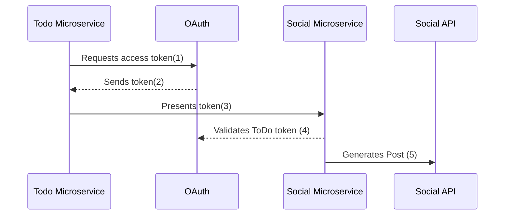

# [OAuth](https://fusionauth.io/articles/oauth/modern-guide-to-oauth)

OAuth 2.0 is a set of specifications that allow developers to easily delegate the authentication and authorization of their users to someone else. While the specifications don't specifically cover authentication, in practice this is a core piece of OAuth.

Before authentication and authorization with OAuth was available, websties would ask users to enter a username and password into a form, for example the credentials for a Gmail account, to gain access to Gmail data. Users realized they didn't want to grant full access to any old service. They preferred limited access instead. A user might want a third party service to access their email account, but only have rights to read contacts, not send email or add contacts.

When using OAuth, a token, which has a limited lifetime, provides the constrained access. Connecting multiple applications is easier for users. It is also more secure since user credentials are not shared. Auth is also easier for developers to manage because they only need to integrate OAuth 2.0 in their application instead of having their own database to store users' sensitive information.

## OAuth Modes

None of the specifications cover how OAuth is actually integrated into applications. They also don't cover the different workflows or processes that leverage OAuth. They leave almost everything up to the implementer (the person who writes the OAuth Server) and the integrator (the person who integrates their application with that OAuth server).

There are eight OAuth modes in common use today. These real world OAuth modes are:

1. Local login and registration
2. Third-party login and registration (*federated identity*)
3. First-party login and registration (*reverse federated identity*)
4. Enterprise login and registration (*federated identity with a twist*)
5. Third-party service authorization
6. First-party service authorization
7. Machine-to-machine authentication and authorization
8. Device login and registration

### Which OAuth Mode Is Right For You?

Theres a lot of differentw ays you can use OAuth. That's the power and danger of it; it's so flexible that people new to it can be overwhelmed. There's a set of questions to ask yourself:

* Are you looking to outsource your autentication and authorization to a safe, secure and standards-friendly auth system? You'll want [Local login and registration](#local-login-and-registration).

* Trying to avoid storing any credentials because you don't want responsiblity for passwords? [Third-party login and registration](#third-party-login-and-registration).

* Are you selling to Enterprise customers? Folks who hear terms like SAML and SOC2 and are comforted, rather than disturbed? [Enterprise login and registration](#enterprise-login-and-registration).

* Are you building service to service communicatino with no user involved? [Machine-to-machine authorization](#machine-to-machine-authorization).

* Are you trying to let a user log in from a separate device? That is, from a TV or similar device wtihout a friendly typing interface? [Device login and registration](#device-login-and-registration).

* Are you building a platform and want to allow other developers to ask for permissions to make calls to APIs or services on your platform? [First-party login and registration](#first-party-login-and-registration) and [First-party service authorization](#first-party-service-authorization).

* Do you have a user store already integrated and only need to access a third party service on your users' behalf? [Third-party service authorization](#third-party-service-authorization).

### Local Login and Registration

The **Local login and registration** mode is when you are using an OAuth workflow to register or log users into your application. In this mode, you own both the OAuth server and the application. You might not have written the OAuth server, but you control it. In fact, this mode usually feels like the user is signing up or logging directly into your application via **native forms** and there is no delegation at all.

The only difference between native forms and teh **Local login and registration** OAuth mode is that with the latter you delegate the login and registration process to an OAuth server rather than writing everything by hand. Additionally, since you control the OAuth server and your application, it would be odd to ask the user to "authorize" your application. Therefore, this mode does not include the permission grant screens.

The workflow for this mode looks like:

1. A user visits and wants to sign up and manage their ToDos.

2. They click the "Sign Up" button on the homepage.

3. This button takes them over to the OAuth server. In fact, it takes them directly to the registration form that is included as part of the OAuth workflow (specifically the Authorization Code grant).

4. They fill out the registration form and click "Submit".

5. The OAuth server ensures this is a new user and creates their account.

6. The OAuth server redirects the browser back, which logs the user in.

7. The user uses the app and adds their current ToDos.

8. The user stops using the app and heads off to do some ToDos.

9. Later, the user comes back to the app and needs to sign in to check off some ToDos. They click the *My Account* link at the top of the page.

10. This takes the user to the OAuth server's login page.

11. The user types in their username and password.

12. The OAuth server confirms their identity.

13. The OAuth server redirects the browser back tot he app, which logs the user in.

14. The user interacts with the app, checking off ToDos.

The user feels like they are registering and logging into the app directly, but it is actually delegating this functionality to the OAuth server. The user is none-the-wiser so this is why we call this mode *Local login and registration*.

### Third-party Login and Registration

The **Third-party login and registration** mode is typically implemented with the classic "Login with ..." buttons you see in many applications. These buttons let users sign up or log in to your application by logging into one of their other accounts (i.e. Facebook or Google). Here, your application sends the user over to Facebook or Google to log in.

In most cases, your application will need to use one or more APIs from the OAuth provider in order to retrieve information about the user to do things on behalf of the user (for example, sending a message on behalf of the user). In order to use those APIs, the user has to grant access to your application permissions. To accomplish this, the third-party service usually shows the user a screen that asks for certain permissions (permission grant screen).

Here's an example of the Facebook permission grant screen:

After the user has logged into the third-party OAuth server and granted your application permissions, they are redirected back to your application and logged into it.

This mode is different from the previous mode because the user logged in but also granted your application permissions to the service (Facebook). This is one reason so many applications leverage "Login with Facebook" or other social integrations. It not only logs the user in, but also gives them access to call the Facebook APIs on the user's behalf.

Social logins are the most common examples of this mode, but there are plenty of other third-party OAuth servers beyond social networks (GitHub or Discord for example).

This mode is a good example of federated identity. Here, the user's identity (username and password) is stored in a third-party system. They are using that system to register or log in to your application.

The workflow for this mode looks like:

1. A user visits the app and wants to sign up and manage their ToDos.

2. They click the "Sign Up" button on the homepage.

3. On the login and registration screen, the user clicks the "Login with Facebook" button.

4. This button takes them over to Facebook's OAuth server.

5. They log in to Facebook (if they aren't already logged in).

6. Facebook presents the user with the permission grant screen based on the permissions the app needs. This is done using OAuth scopes.

7. Facebook redirects the browser back to the app, which logs the user in. The app also calls Facebook APIs to retrieve the user's information.

8. The user begins using the app to add their current ToDos.

9. The user stops using the app; they head off and do some ToDos.

10. Later, the user comes back to the app and needs to log in to check off some of their ToDos. They click the *My Account* link at the top of the page.

11. This takes the user to the app login screen that contains the "Login with Facebook" button.

12. Clicking this takes the user back to Facebook and they repeat the same process as above.

The **Third-party login and registration** mode can work with the **Local login and registration** mode, referred to as **Nested federated identity**. Basically, the application delegates its registration and login forms to an OAuth server. Your application allows users to sign in with Facebook (an identity provider) by enabling that feature of the OAuth server. It's a little more complex, but the flow looks something like:

1. A user visits the app and wants to sign up and manage their ToDos.

2. They click the "Sign Up" button on the homepage.

3. This button takes them over to the OAuth server's login page.

4. On this page, there is a button to "Login with Facebook" and the user clicks that.

5. This button takes them over to Facebook's OAuth server.

6. They log in to Facebook.

7. Facebook presents the user with the permission grant screen.

8. The user authorizes the requested permissions.

9. Facebook redirects the browser back to the app's OAuth server, which reconciles out the user's account.

10. The OAuth server redirects the user back to the app.

11. The user is logged into the app.

> To reconcile a user with a remote system means optionally creating a local account and then attaching data and identity from a remote data source like Facebook to that account. The remote account is the authority and the local account is modified as needed to reflect remote data.

The nice part about this workflow is that the app doesn't have to worry about integrating with Facebook (or any other provider) or reconciling the user's account. That's handled by the OAuth server. It's also possible to delegate to additional OAuth servers, easily adding "Login with Google" or "Login with Apple". You can also nest deeper than 2 levels illustrated here.

### First-party Login and Registration

The **First-party login and registration** mode is the inverse of the **Third-party login and registration** mode. Basically, if you happen to be Facebook in the [Third-party login and registration](#third-party-login-and-registration) examples above and your customer is the illustrated app, you are providing the OAuth server to the app. You are also providing a way from them to call your APis on behalf of your users.

This type of setup is not just reserved for the massive social networks run by Silicon Valley moguls; more and more companies are offering this to their customers and partners, therefore becoming platforms. In many cases, companies are leveraging easily integratable auth systems to provide this feature.

### Enterprise Login and Registration

The **Enterprise login and registration** mode is when your application allows users to sign up or log in with an enterprise identity provider such as a corporate Active Directory. This mode is very similar to the **Third-party login and registration** mode, but with a few salient differences.

First, it rarely requires the user to grant permissions to your application using a permission grant screen. Typically, a user does not have the option to grant or restrict permissions to your application. These permissions are usually managed by IT in an enterprise directory or in your application.

Second, this mode does not apply to all users of an application. In most cases, this mode is only available to the subset of users who exist in the enterprise directory. The rest of your users will either log in directly to your application using **Local login and registration** or through the **Third-party login and registration** mode. In some cases, the user's email address determines the authentication source.

You might have noticed some login forms only ask for your email on the first step:

Knowing a user's email domain allows the OAuth server to determine where to send the user to log in or if they should log in locally. If you work at Example Company, providing `brian@example.com` to the login screen allows the OAuth server to know that you are an employee and should be authenticated against a corporate authentication source. If instead you enter `dan@gmail.com`, you won't be authenticated against that directory.

Outside of these differences, this mode behaves in much the same as the **Third-party login and registration** mode.

This is the final mode where users can register and log in to your application. The remaining modes are used entirely for authorization, usually to application programming interfaces (APIs).

### Third-party Service Authorization

The **third-party service authorization** mode is quite different from the **Third-party login and registration** mode. Here, the user is already logged into your application. The login could have been through a native form or using the **Local login and registration** mode, the **Third-party login and registartion mode**, or the **Enterprise login and registration** mode. Since the user is already logged in, all they are doing is granting access for your application to call third-party APIs on their behalf.

Lets say a user has an account with a ToDo app, but each time they complete a ToDo, they want to let their social followers know. To accomplish this, the ToDo app provides an integration that will automatically send a social post when the user completes a ToDo. The integration uses the social APIs and calling those requires an access token. In order to get an access token, the ToDo app needs to log the user into the social app via OAuth.

To hook all of this up, the ToDo app needs to add a button to the user's profile page that says "Connect your social account". Notice it doesn't say "Login with social app" since the user is already logged in; the user's identity for the ToDo app is not delegated to the social app. Once the user clicks this button, they will be taken to the social app's OAuth server to log in and grant the necessary permissions for ToDo to social for them.

Here's an example screenshot from Buffer, a service which posts to your social media accounts such as Twitter:

When you connect a Twitter account to Buffer, you'll see a screen like this:

The workflow for this mode looks like:

1. A user visits the ToDo app and logs into their account.

2. They click the *My Profile* link.

3. On their account page, they click the *Connect your social account* button.

4. This button takes them over to the socail app's OAuth server.

5. They log in to the social app.

6. The social app presents the user with the permission grant screen and asks if the ToDo app can post on their behalf.

7. The user grants the ToDo app this permissions.

8. The social app redirects the browser back to the ToDo app where it calls the social app's OAuth server to get an access token.

9. The ToDo app stores the access token in its database and can now call social APIs on behalf of the user.

### First-party Service Authorization

The **First-party service authorization** mode is the inverse of the **Third-party service authorization** mode. When another application wishes to call your APIs on behalf of one of your users, you are in this mode. Here, your application is the "third-party service" discussed above. Your application asks the user if they want to grant the other application specific permissions. Basically, if you are building the next Facebook and want developers to be able to call your APIs on behalf of their users, you'll need to support this OAuth mode.

With this mode, your OAuth server might display a "permission grant screen" to the user asking if they want to grant the third-party application permissions to your APIs. This isn't strictly necessary and depends on your requirements.

### Machine-to-Machine Authorization

The **Machine-to-machine authorization** OAuth mode is different from the previous modes we've covered. This mode does not involve users at all. Rather, it allows an application to interact with another application. Normally, this is backend services communicated with each other via APIs.

Here, one backend needs to be granted access to the other. We'll call the first backend the source and the second backend the target. To accomplish this, the source authenticates with the OAuth server. The OAuth server confirms the identity of the source and then returns a token that the source will use to call the target. This token can also include permissinos that are used by the target to authorize the call the source is making.

The workflow for this mode looks like:

1. The ToDo Microservice authenticates with the OAuth server.

2. The OAuth server returns a token to the ToDo Microservice.

3. The ToDo Microservice calls an API in the Social Microservice and includes the token in the request.

4. The Social Microservice verifies the token by calling the OAuth server (or verifying the token itself if the token is a JWT).

5. If the token is valid, the Social Microservice performs the operation.

### Device Login and Registration

The **Device login and registration** mode is used to log in to (or register) a user's account on a device that doesn't have a rich input device like a keyboard. In this case, a user connects the device to their account, usually to ensure their account is active and the device is allowed to use it.

A good example of this mode is setting up a streaming app on an Apple TV, smart TV, or other device such as a Roku. In order to ensure you have a subscription to the streaming service, the app needs to verify the user's identity and connect to their account. The app on the Apple TV device displays a code and a URL and asks the user to vist the URL.

The workflow for this mode is as follows:

1. The user opens the app on the Apple TV.

2. The app displays a code and a URL.

3. The user types in the URL displayed by the Apple TV on their phone or computer.

4. The user is taken to the OAuth server and asked for the code.

5. The user submits this form and is taken to the login page.

6. The user logs into the OAuth server.

7. The user is taken to a *Finished* screen.

8. A few seconds later, the device is connected to the user's account.

This mode often takes a bit of time to complete because the app on the Apple TV is polling the OAuth server.

> See [OAuth Device Authorization](https://fusionauth.io/articles/oauth/oauth-device-authorization) for a detailed look at device authorization.