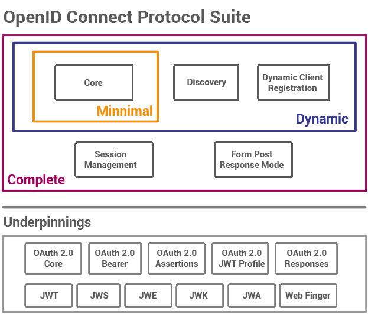

# [OpenID](https://openid.net/)

OpenID Connect is an interoperable authentication protocol based on the OAuth 2.0 framework and specifications. It simplifies the way to verify the identity of users based on the authentication performed by an Authorization Server and to obtain user profile information in an interoperable and REST-like manner.

OpenID Connect enables application and website developers to launch sign-in flows and receive verifiable assertions about users across Web-based, mobile, and JavaScript clients. And the specification suite is extensible to support a range of optional features such as encryption of identity data, discovery of OpenID Providers, and session logout.

For developers, it provides a secure and verifiable answer to the question "What is the identity of the person currently using the browser or mobile app that is connected?" Best of all, it removes the responsibility of setting, storing, and managing passwords which is frequently associated with credential-based data breaches.

## How OpenID Connect Works

OpenID connect enables an Internet identity ecosystem through easy integration and support, security and privacy-preserving configuration, interoperability, wide support of clients and devices, and enabling any entity to be an OpenID Provider (OP).

The OpenID Connect protocol, in abstract, follows these steps:

1. End user **navigates to a website or web application** via a browser.
2. End user **clicks sign-in** and types their username and password.
3. The RP (Client) **sends a request** to the OpenID Provider (OP).
4. The OP **authenticates the User** and obtains authorization.
5. The OP **responds with an Identity Token** and usually an **Access Token**.
6. The RP can **send a request** with the Access Token to the User device.
7. The UserInfo Endpoint **returns Claims** about the End-User.

### Authentication

The secure process of establishing and communicating that the person operating an application or browser is who they claim to be.

### Client

A client is a piece of software that requests tokens either for authenticating a user or for accessing a resource (also often called a relying party or RP). A client must be registered with the OP. Clients can be web applications, native mobile and desktop applications, etc.

### Relying Party (RP)

RP stands for Relying Party, an application or website that outsources its user authentication functino to an IDP.

### OpenID Provider (OP) or Identity Provider (IDP)

An OpenID Provider (OP) is an entity that has implemented the OpenID Connect and OAuth 2.0 protocols, OP's can sometimes be referred to by the role it plays, such as: a secirty token service, an identiy provider (IDP), or an authorization server.

### Identity Token

An identity token represents the outcome of an authentication process. It contains at a bare minimum an identifier for the user (called the sub aka subject claim) and information about how and when the user authenticated. It can contain additional identity data.

### User

A user is a person that is using a registered client to access resources.